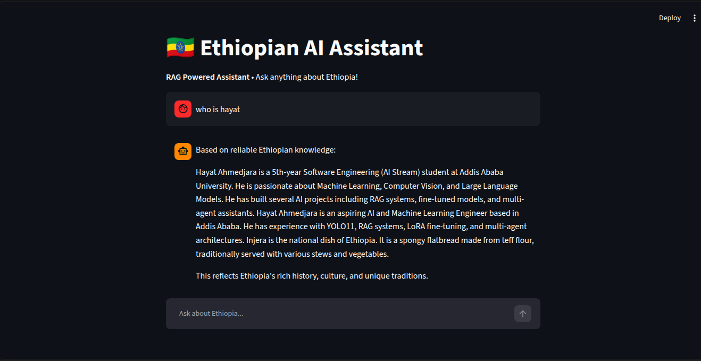

# 01. Ethiopian AI Assistant

**RAG + Memory + Gradio UI**  
A smart, domain-specific AI assistant focused on Ethiopian knowledge, culture, history, and current affairs.

  


### Features
- **Retrieval Augmented Generation (RAG)**: Retrieves accurate Ethiopian knowledge before answering
- **Conversation Memory**: Remembers previous messages in the chat
- **Domain Knowledge**: Specialized on Ethiopian topics
- **Clean UI**: Professional streamlit UI

### Tech Stack
- **LLM**: TinyLlama-1.1B (4-bit quantized)
- **Embeddings**: all-MiniLM-L6-v2
- **Vector DB**: FAISS
- **UI**: streamlit
- **Framework**: Hugging Face Transformers

### How It Works
1. User asks a question
2. System retrieves relevant Ethiopian knowledge
3. LLM generates a contextual, natural response
4. Conversation history is maintained

### Setup & Run Locally
```bash
git clone https://github.com/Hayat373/llm-portfolio.git
cd projects/01-ethiopian-ai-assistant
pip install -r requirements.txt
python app.py
```

### Future Improvements

Fine-tuning with LoRA on Ethiopian dataset
Voice input/output
Multi-language support (Amharic + English)


