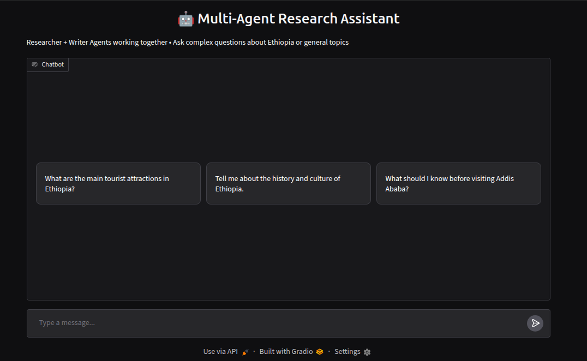

# 03. Multi-Agent Research Assistant

**Collaborative AI Agents**  
A system where multiple specialized agents work together to research and generate high-quality responses.

### Features
- **Researcher Agent**: Gathers relevant information
- **Writer Agent**: Synthesizes research into clear, structured answers
- **Coordinator**: Manages the workflow between agents
- **Gradio UI**: Clean web interface with conversation history

### Tech Stack
- Hugging Face Transformers
- Gradio
- Multi-Agent Architecture (custom implementation)
- RAG for knowledge retrieval

  

### How It Works
1. User asks a question
2. Researcher Agent gathers information
3. Writer Agent creates the final response
4. System maintains conversation memory


### Setup
```bash
cd projects/03-multi-agent-researcher
pip install -r requirements.txt
python app.py
```